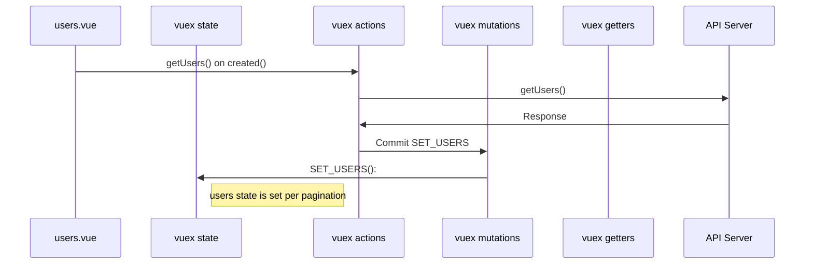

# Flow Map of User Pages

The following are application flow for each of views in User Pages.

## Users.vue
`Users.vue` is the list page, this page used to view every users in Lokaven: Guest, Host, or Deactivated Users. The flow of this page is as follow:

